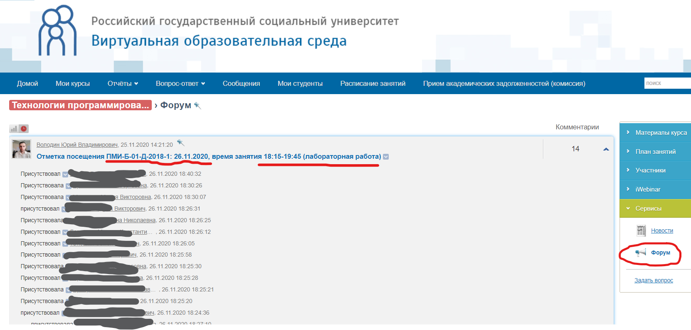
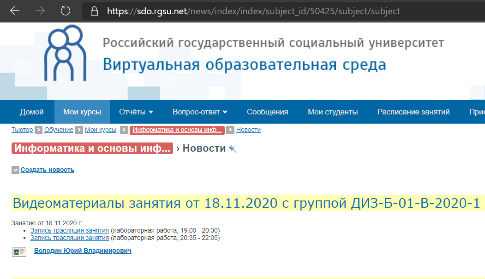
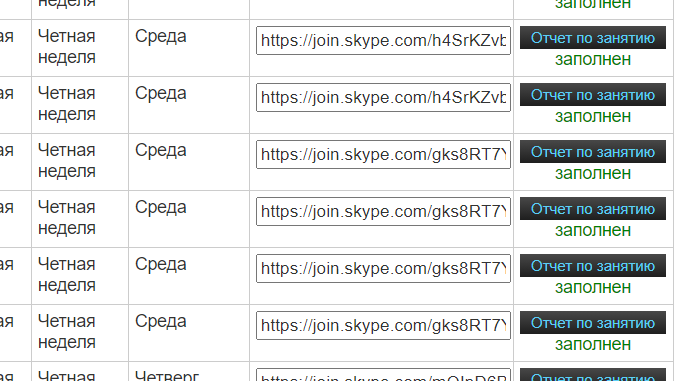
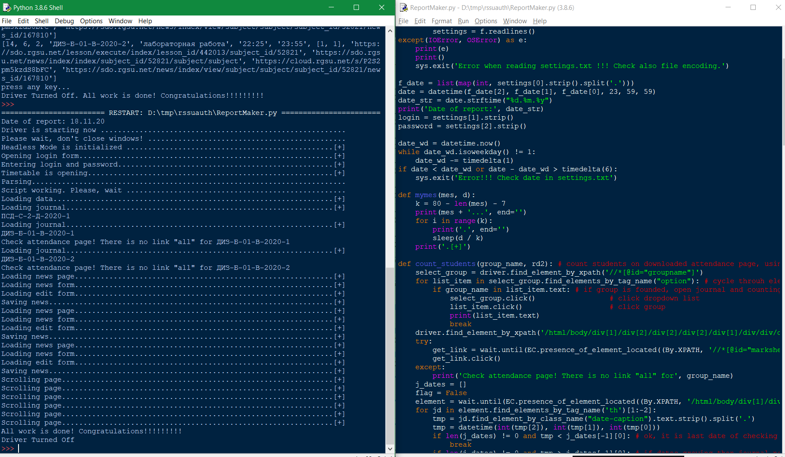
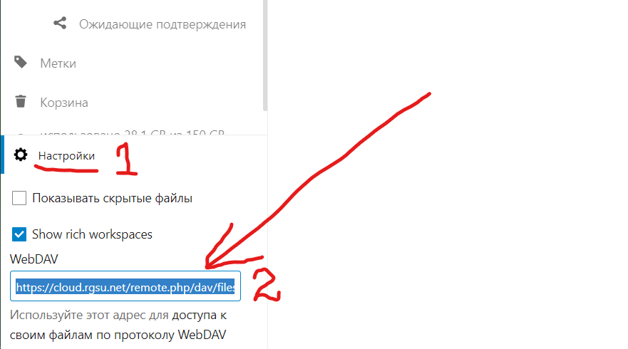
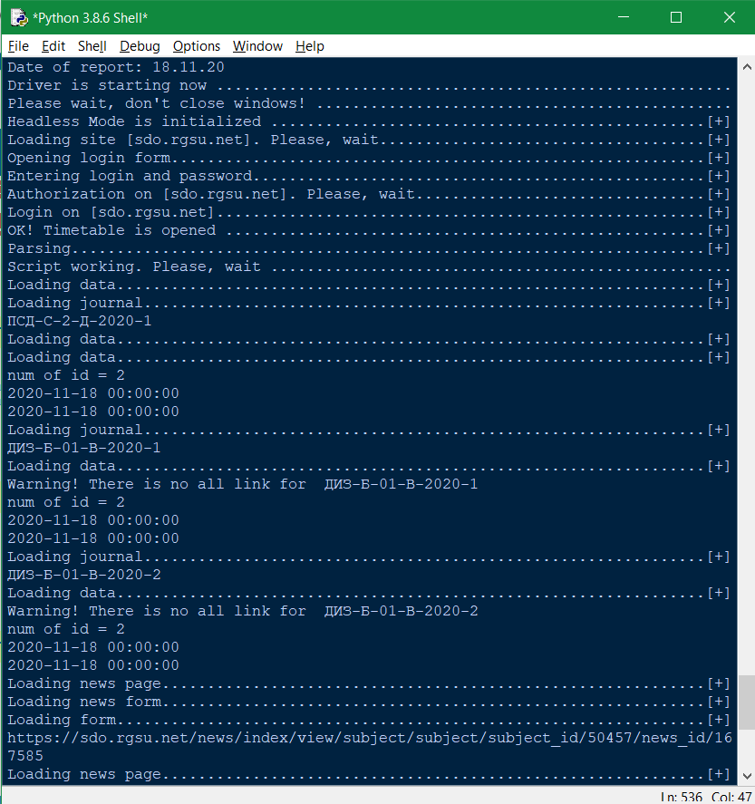
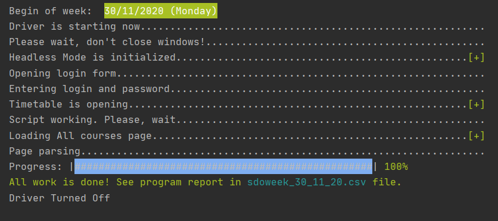

# ReportMaker - автоматическое создание отчёта преподавателя
Скрипт обрабатывает данные в личном кабинете преподавателя на сайте sdo.rgsu.net, создаёт новости в соответствующих курсах (согласно требованиям) и заполняет отчёт о проведённых занятиях в заданную дату.

## Как пользоваться?

### Установка и настройка
1. [Скачать все скрипты](https://github.com/vol1ura/SDO_ReportMaker/archive/master.zip) из репозитория в какой-нибудь каталог на компьютере
2. *Скачать драйвер* своего браузера
3. *Настроить* интерпретатор Python, либо воспользоваться собранными `exe` файлами (в папке `exe`)
4. *Создать текстовый файл* `settings.txt` в каталоге скрипта

Подробное описание пунктов 2-4 см. ниже.

### Создание отчёта
#### Подготовка к рабочей неделе
Где-то в конце недели или в самом начале рабочей недели, перед парами, необходимо произвести следующие подготовительные действия
##### 1. Получение информации о предстоящих парах
Используем скрипт `getWeekData.py` (либо соответствующий `exe` файл) для формирования файла с данными обо всех занятиях предстоящей недели.
Скрипт запускается командой
```bash
python getWeekData.py
```
если нужно сформировать данные по текущей неделе, либо командой
```bash
python getWeekData.py n
```
если нужно сформировать данные для следующей недели.

В результате в рабочей папке появится `dat` файл. Например, файл `sdoweek_30_11_20.dat` будет содержать данные о парах
для недели, начинающейся 30 ноября 2020 года.
##### 2. Создание топиков в форуме
Для отметки студентов на занятиях используется функционал форумов СДО. 

Скрипт `CreateForumTopics.py` (либо соответствующий `exe` файл) генерирует топики в разделе Сервисы-Форум для отметки и верификации присутствия студентов 
на занятиях.
Команда 
```bash
python CreateForumTopics.py
```
сформирует топики для каждой пары текущей недели. Ещё раз на этой неделе запускать скрипт не нужно. 
Для формирования топиков на следующую неделю запускаем так
```bash
python CreateForumTopics.py n
```
при этом уже *должен быть сформирован* соответствующий `dat` файл (см. выше).

В созданных темах студенты производят отметку о присутствии, а преподаватель визуально контролирует отметку и подключение студента к видеоконференции. Время отметки должно быть строго во временном промежутке соответствующего занятия. Лишние отметки, а также отметки в другое время не учитываются при подсчёте числа посещений и в журнал не проставляются (за это отвечает скрипт `ReportMaker.py`).



#### 3. Делаем отчёт
В конце рабочего дня делаем стандартный отчёт о проведённых занятиях. Порядок действий следующий
1. *Видеозаписи* проведённых занятий должны именоваться последовательно Video1 Video2 ... Video9 (одно видео — одна пара). Желательно, чтобы они находились в отдельной папке на диске
2. *Запускаем скрипт* либо из командной строки `python ReportMaker.py` либо кликая `ReportMaker.exe`. Если отчёт заполняется за другой день, надо передать дату через командную строку `python ReportMaker.py дд.мм.гг` или `ReportMaker.exe дд.мм.гг` (заполнить можно только отчёты текущей недели)
3. Идём *пить чай*


## Что получаем?
* Новости для всех групп и курсов из расписания на заданную дату



* Заполненный отчёт по заданной дате



* Видеоматериалы загружены в облако РГСУ

* Файл `report.txt` в том же каталоге с результатами работы скрипта — пары, группы, количество посещений, ссылка на новость, ссылка на видеоматериал.

## Описание настройки и установки

### Установка и настройка драйвера браузера
Если вы используете Firefox, то скачиваете `geckodriver.exe`, а если Chrome, то `chromedriver.exe`. В `settings.txt` прописываем название браузера, скрипт автоматически определяет какой драйвер использовать и какие модули загружать.

При использовании Edge **версия драйвера должна точно соответствовать версии браузера** в системе (см. скриншот ниже). Подробнее см. [документацию](https://docs.microsoft.com/en-us/microsoft-edge/webdriver-chromium/?tabs=python). 
Кроме того, в скриптах надо будет изменить название подключаемого модуля с `from sdodriver import sdodriver as sdo`
на `from sdodriver import edge as sdo`. 



**Замечание.** Драйвер Edge работает быстро, но выдаёт логи в консоль (как это победить я не знаю), и его модуль плохо дружит с модулями других драйверов selenium.

При использовании Safari потребуются дополнительные настройки браузера. Кроме того, там не доступен headless режим.

###### Ссылки для загрузки драйвера
1. geckodriver доступен здесь [https://github.com/mozilla/geckodriver/releases](https://github.com/mozilla/geckodriver/releases)
2. chromedriver доступен здесь [https://sites.google.com/a/chromium.org/chromedriver/home](https://sites.google.com/a/chromium.org/chromedriver/home)
3. msedgedriver доступен здесь [https://developer.microsoft.com/en-us/microsoft-edge/tools/webdriver/](https://developer.microsoft.com/en-us/microsoft-edge/tools/webdriver/)
4. safaridriver доступен здесь [https://webkit.org/blog/6900/webdriver-support-in-safari-10/](https://webkit.org/blog/6900/webdriver-support-in-safari-10/)

### Настройка интерпретатора Python

1. Скачать и установить Python https://www.python.org/downloads/
2. В cmd или в PowerShell перейти в каталог с распакованными скриптами и выполнить установку необходимых пакетов
```bash
pip install --upgrade pip
pip install -r requirements.ini
```

### Формат файла settings.txt
Создаём простой текстовый файл, состоящий из 6 строк: 
1. Ваш *логин* для [sdo.rgsu.net](https://sdo.rgsu.net)
2. Ваш *пароль* для [sdo.rgsu.net](https://sdo.rgsu.net)
3. *URL-токен* для доступа к [cloud.rgsu.net](https://cloud.rgsu.net) по протоколу WebDAV
4. *Путь к каталогу с видеозаписями* проведённых в этот день занятий. Число видео = числу пар в этот день! Файлы должны называться **строго** Video1, Video2 и т.д.
5. *Название вашего браузера* - Firefox, Google Chrome, Edge или Safari.
6. *Путь к драйверу* вашего браузера (можно поместить его, например, в каталоге вместе со скриптами — см. пример)

Если где-то, например, в пути к видеофайлам используется кириллица, файл должен быть сохранён **строго** в кодировке UTF-8! Но лучше, чтобы пути были без кириллицы и без пробелов.

Например,
> volodinyv<br />
> qWerTy<br />
> https://cloud.rgsu.net/remote.php/dav/files/AAA1BBBC-1234-5678-9DEF-AA00000000BC/ <br />
> C:\\Users\\Yuriy\\Downloads\\rgsu_video<br />
> Edge<br />
> .\\msedgedriver.exe

URL-токен копируется из личного кабинета [cloud.rgsu.net](https://cloud.rgsu.net). Это делается единожды. По сути, в настройках далее больше ничего менять не придётся, **отчёты будут заполняться одним кликом мышкой**



## Особенности и возможные проблемы

Большие видеофайлы могут потребовать много времени для загрузки. Надо просто подождать, пока прогресс не дойдёт до 100%. Можно даже предварительно загрузить видео через веб интерфейс (но все файлы всё равно должны лежать в папке, указанной в настройках), главное строго соблюдать порядок именования и вложенности папок, используемый скриптом, тогда он автоматически пропустит загруженные файлы и догрузит недостающие (при этом генерировать ссылки не нужно, это сделает скрипт).

Если загрузка видео файла не смогла стартовать или оборвалась, надо просто перезапустить скрипт, он продолжит загрузку.

Начиная с версии 2.0, скрипт заполняет журналы посещения автоматически на основе записей студентов в разделе Форум и соответствующей теме. Если вы предварительно не сгенерировали скриптом `CreateForumTopics.py` топики в Форуме и/или заполнили журналы по данной дате вручную, скрипт не вычислит количество посещений, и значения придётся внести вручную.

Начиная с версии 3.1 нет необходимости устанавливать и настраивать Python. Можно скачать и использовать собранные `exe` файлы. В папку к распакованным программам надо только скачать соответствующий дайвер браузера и настроить файл `settings.txt`. Если файлы не запускаются, скорее всего, этот файл настроен неправильно.

Сборка `exe` файлов происходит с задержкой. Самая актуальная версия в виде скриптов.

## Системные требования
* Python версии не ниже 3.4.
* Установлены пакеты selenium, colorama, webdavclient3 (см. `requirements.ini`)
* Стабильное скоростное подключение к Internet (20 Mbit/s и выше)
* Оперативная память от 2 Gb
* Разрешение экрана не менее FullHD (1920×1080 pixels)

### Проверка работы
* Скрипт протестирован с браузером Firefox v83.0 (64-битный) и драйвером geckodriver v0.28.0 (win64) на Windows 10
* Скрипт протестирован с браузером Edge и драйвером edgedriver v87.0.664.60 (win64) на Windows 10
* Скрипт протестирован с браузером Firefox v84.0 (64-битный) и драйвером geckodriver v0.28.0 (linux64) на Ubuntu 20.10
* Сообщалось, что с Chrome и chromedriver 32bit тоже всё работает

### Примеры работы программы




### Что добавлено?
###### Версия 3.33:
* Значительно ускорен скрипт формирования отчёта
* Оптимизирован скрипт получения информации о занятиях на неделю

###### Версия 3.32:
* Переписана программа сбора информации из расписания на неделю без использования драйвера браузера. 
  Скорость значительно возросла.
* Оптимизация процесса сбора отметок о посещениях студентов на парах.

###### Версия 3.31:
* Переписана программа создания топиков в форумах, теперь не используется драйвер браузера. Скорость значительно возросла.
* Незначительная оптимизация
* Если видео загружено в облако и расшарено, программа получит ссылку и продолжит работу (раньше вылетала)
* Если не получится загрузить журнал посещений, программа пропустит этот журнал и продолжит работу без подсчёта посещаемости (раньше вылетала)

###### Версия 3.3:
* Улучшена производительность, повышена стабильность
* Переработан код — основные блоки выделены в универсальный модуль `sdodriver`. Дописаны классы для использования с браузерами Safari и Edge
* Протестирована работа с браузером Edge. Работает шустро.

###### Версия 3.2:
* Оптимизация локаторов элементов, небольшое ускорение в модулях `getWeekData` и `ReportMaker`
* Хранение промежуточных данных в более подходящем формате — теперь создаётся бинарный файл dat вместо csv
* Скорректированы сообщения в консоль при работе скриптов

###### Версия 3.1:
* Добавлены собранные exe файлы для пользования программами без установки Python на компьютер. Порядок действий остаётся прежним

###### Версия 3.0:
* Доработана логика работы программы. Большая часть данных собирается заранее сразу на всю неделю с помощью скрипта `getWeekData.py`, что потом ускоряет создание ежедневных отчётов
* Изменён механизм загрузки видео. Загрузка видео сделана стабильной и более информативной
* Добавлено цветовое выделение информационных сообщений
* Переработаны прогресс бары загрузки

###### Версия 2.0:
* Добавлен функционал автоматического заполнения журнала посещений
* Добавлен скрипт `CreateForumTopics.py`, генерирующий топики в СДО в разделе Сервисы-Форум для отметки и верификации присутствия студентов на парах
* Загрузка видеоматериалов сделана в асинхронном режиме (параллельно с работой скрипта) по протоколу WebDAV (есть ограничения на сервере cloud.rgsu.net, поэтому в следующей версии пришлось отказаться)
* Загрузка видео стартует с началом работы скрипта, что экономит некоторое время, пока идёт обработка остальных данных
* Если вы загрузили видео в соответствующую папку (см. код скрипта), то повторная загрузка не производится, скрипт догрузит недостающие файлы
* Переработаны информационные сообщения, добавлены прогресс-бары загрузки
* Сделана проверка имени видео файла по шаблону (фильтрация посторонних файлов в каталоге)
* Улучшена логика доступа к отдельным элементам, повышена универсальность и стабильность
* Полностью переработана внутренняя структура данных

###### Версия 1.1:
* По умолчанию используется текущая дата. Файл настроек теперь нужно править каждый раз. Альтернативная дата передаётся через параметр командной строки
* Теперь можно использовать любой формат даты — как ДД.ММ.ГГГГ, так и ДД.ММ.ГГ
* Небольшая оптимизация

###### Версия 1.0:
* Добавлена автоматическая загрузка видео в [cloud.rgsu.net](https://cloud.rgsu.net) по протоколу WevDAV
* Автоматическая генерация ссылок на видеоматериалы в [cloud.rgsu.net](https://cloud.rgsu.net)
* Оптимизированы задержки и ускорена работа
* Повышена стабильность
* Локаторы элементов изменены на более универсальные
* ~~Добавлен файл `ReportMaker.bat` для запуска скрипта сразу из проводника Windows (рекомендуется)~~
* Хранение всех настроек в одном файле

###### Версия 0.92a:
* Хранение логина и пароля от аккаунта [sdo.rgsu.net](https://sdo.rgsu.net) вынесено во внешний каталог в отдельный файл

###### Hotfix 0.91:
* Пофикшена проверка группы в списке Мои курсы. У некоторых групп набор параметров отличается. Теперь должно работать в широких пределах
* Пофикшен запрос получения ссылки на новость, который поломался после добавления разработчиками сайта новой кнопочки на страничку Новости

###### Версия 0.9:
* Заполняется отчёт в расписании преподавателя
* Некоторые улучшения и оптимизация скорости работы

###### Версия 0.8:
* Подсчитывается посещаемость
* Заполняются новости, и создаётся файл report.txt со ссылками на них

###### Версия 0.7:
* Убрал использование пакета BeautifulSoup, оставил только Selenium
* Скрипт заходит в расписание и обрабатывает данные по заданному дню 

### ToDo
- [ ] Добавить ключи запуска с опциями пропуска скриптом отдельных этапов
- [ ] Сделать веб-приложение
- [ ] Собрать исполняемые файлы
- [ ] Загрузка видео через веб-запросы через API WebDAV или NextCloud
- [x] Сделать опцию как формировать топики форума — на следующую неделю либо с этого дня до конца текущей недели
- [x] Автоматическая загрузка видео в cloud
- [x] Автоматическая отметка студентов в журнале посещений. Реализация через Форум СДО
